# NexusPlay POC — Architecture & Build Report

A complete proof-of-concept showing the full path from a developer pushing code to a
running, autoscaled, monitored, alerting web application on AWS — built entirely with
CloudFormation, the AWS CLI, and a single t3.micro fleet.

## 1. Architecture diagram

```mermaid
flowchart TB
    %% Internet
    Internet((Internet / players)):::ext

    %% DNS / Edge
    subgraph Edge["Edge (internet-facing)"]
        ALB["ALB<br/>nexusplay-alb<br/>path routing:<br/>/game/* · /players/*"]:::edge
        HostedZone["nexusplay.lab zone<br/>(authoritative)"]:::edge
    end

    %% VPC
    subgraph VPC["VPC (private, no NAT)"]
        direction TB

        subgraph DNS["DNS tier (DnsSG)"]
            BIND_P["BIND primary<br/>i-08d38575acca738dc<br/>172.31.33.112"]:::dns
            BIND_S["BIND secondary<br/>i-0901b24083dd18139<br/>172.31.41.135"]:::dns
        end

        subgraph App["App tier (AppSG)"]
            direction TB
            LT_G["LT nexusplay-game-lt"]:::lt
            ASG_G["ASG nexusplay-game-asg<br/>2-3 × t3.micro"]:::asg
            LT_P["LT nexusplay-player-lt"]:::lt
            ASG_P["ASG nexusplay-player-asg<br/>2-3 × t3.micro"]:::asg
            GameContainers["game-service containers<br/>(FastAPI / uvicorn)"]:::ctr
            PlayerContainers["player-service containers<br/>(FastAPI / uvicorn)"]:::ctr
            CWAgent["CloudWatch agent<br/>(ship container logs)"]:::cw
        end

        subgraph Data["Data tier"]
            RDS[("RDS PostgreSQL<br/>nexusplay-db<br/>db.t3.micro · 20GB gp3")]:::data
            Redis[("ElastiCache Redis<br/>nexusplay-redis<br/>cache.t3.micro · primary+replica<br/>TLS + AUTH")]:::data
        end

        subgraph EP["VPC endpoints (private)"]
            E_SSM["ssm · ssm-messages · ec2-messages"]:::ep
            E_EC2["ec2"]:::ep
            E_SEC["secretsmanager"]:::ep
            E_ECR["ecr-api · ecr-dkr"]:::ep
            E_LOGS["logs"]:::ep
            E_CACHE["elasticache"]:::ep
            E_RDS["rds"]:::ep
            E_ALB["elasticloadbalancing"]:::ep
            E_S3["S3 gateway<br/>(com.amazonaws.us-east-1.s3)"]:::ep
        end

        CWLogs[/"CloudWatch Logs<br/>/aws/nexusplay/app"/]:::cw
        CWMet[/"CloudWatch Metrics<br/>(ASG, ALB, RDS, Redis,<br/>NexusPlay/App.AppErrors)"/]:::cw
        Dashboard[/"Dashboard: NexusPlay<br/>(7 widgets)"/]:::cw
        CWAlarm[/"CloudWatch Alarms<br/>(5 alarms, SNS-wired)"/]:::cw
        SNSTopic[/"SNS nexusplay-alerts<br/>email: zineddine.berrichi@supdevinci-edu.fr"/]:::cw
    end

    %% Secrets
    Secrets["Secrets Manager<br/>db-password · redis-auth · app-secret<br/>github-pat · slack-webhook"]:::secrets

    %% ECR
    ECR[("ECR<br/>nexusplay/game-service<br/>nexusplay/player-service")]:::ecr

    %% Internet → ALB
    Internet -->|HTTPS/HTTP 80| ALB

    %% ALB → ASGs
    ALB -->|/game/*| GameContainers
    ALB -->|/players/*| PlayerContainers
    ALB -.->|TG| ASG_G
    ALB -.->|TG| ASG_P

    %% Containers → Data
    GameContainers -->|TLS · AUTH| Redis
    GameContainers -->|5432| RDS
    PlayerContainers -->|5432| RDS

    %% DNS
    App -.->|resolv.conf → BIND| BIND_P
    App -.->|fallback| BIND_S
    BIND_P -.->|AXFR| BIND_S
    BIND_P -.->|forward| HostedZone
    BIND_P -->|forward to Amazon DNS| AmazonDNS((AmazonProvidedDNS))
    BIND_S -.->|forward| AmazonDNS

    %% Endpoints
    App -.->|ECR pull| E_ECR
    App -.->|secrets fetch| E_SEC
    App -.->|SSM agent| E_SSM
    App -.->|CW agent logs| E_LOGS
    CWAgent -->|push| CWLogs
    CWLogs -->|metric filter| CWMet
    Dashboard -.->|reads| CWMet
    ALB -->|emits| CWMet
    Data -->|emits| CWMet
    App -.->|EC2 metrics| E_EC2

    %% DNS discovery (CRUD)
    BIND_P -.->|ELB describe| E_ALB
    BIND_P -.->|RDS describe| E_RDS
    BIND_P -.->|ElastiCache describe| E_CACHE
    BIND_P -.->|EC2 describe| E_EC2

    %% SNS
    CWAlarm -->|notify| SNSTopic

    %% CI/CD
    Github[(GitHub)]:::ext
    Github -->|OIDC + ECR push + LT update + ASG refresh| ECR
    ECR -->|docker pull| GameContainers
    ECR -->|docker pull| PlayerContainers
    Secrets -->|get-secret-value| GameContainers
    Secrets -->|get-secret-value| PlayerContainers

    %% Styles
    classDef ext fill:#ffe,stroke:#aa6
    classDef edge fill:#eef,stroke:#446
    classDef dns fill:#fef,stroke:#a46
    classDef asg fill:#efe,stroke:#464
    classDef lt fill:#ffd,stroke:#aa4
    classDef ctr fill:#dff,stroke:#448
    classDef data fill:#fee,stroke:#a44
    classDef cw fill:#fdf,stroke:#a4a
    classDef ep fill:#eee,stroke:#666
    classDef secrets fill:#ffe7d9,stroke:#a64
    classDef ecr fill:#e7f5ff,stroke:#46a
```

## 2. Stack map

| # | Stack | CFN template | Purpose |
|---|---|---|---|
| 0 | `nexusplay-00-foundation` | pre-existing | Voclabs VPC + subnets + LabRole |
| 1 | `nexusplay-10-network` | `10-network.yaml` | 9 security groups, 11 interface VPC endpoints, S3 gateway + prefix-list egress |
| 2 | `nexusplay-20-dns` | `20-dns.yaml` | BIND primary + secondary instances, 1-min zone-discovery cron |
| 3 | `nexusplay-30-secrets` | `30-secrets.yaml` | 5 Secrets Manager secrets (DB, Redis, app, PAT, Slack) |
| 4 | `nexusplay-40-cache` | `40-cache.yaml` | ElastiCache Redis replication group (primary + replica) |
| 5 | `nexusplay-50-db` | `50-db.yaml` | RDS PostgreSQL single-AZ |
| 6 | `nexusplay-60-app` | `60-app.yaml` | Game-service + player-service Launch Templates + ASGs |
| 7 | `nexusplay-70-alb` | `70-alb.yaml` | ALB + 2 target groups + path-based listener rules |
| 8 | `nexusplay-80-autoscaling` | `80-autoscaling.yaml` | Target-tracking + scheduled + alarms |
| 9 | `nexusplay-90-monitoring` | `90-monitoring.yaml` | CloudWatch dashboard + log group + app error alarm |
| 10 | `nexusplay-100-notifications` | `100-notifications.yaml` | SNS topic + email + ALB 5xx / RDS connection alarms |
| 11 | `nexusplay-110-github-oidc` | (deployment blocked by IAM) | GitHub OIDC deploy role template (one-time admin) |

## 3. Verification results — every phase was live-verified

| Phase | What was verified | Evidence |
|---|---|---|
| 1 | 11 interface endpoints + S3 gateway reachable from a no-public-IP instance | `curl https://secretsmanager.us-east-1.amazonaws.com/` via endpoint; `aws s3 cp` to bucket without internet |
| 2 | Primary answers, secondary AXFRs, failover works | `dig @127.0.0.1`, AXFR on boot, stop primary `named` → secondary serves, 5/5 queries return 200 during outage |
| 3 | All 5 secrets retrievable | `aws secretsmanager get-secret-value` on instance: db 32 chars, redis 32, app 48, placeholders present |
| 4 | Cache-aside round-trip + replication | PING→PONG, SET/GET, `keyspace_hits 1→2`, `role:master connected_slaves:1` |
| 5 | DB connection + CRUD | psql version 17.10, CREATE/INSERT/SELECT round-trip via `db.nexusplay.lab` DNS |
| 6 | App cache-aside + CRUD | `source:db` first → `source:cache` next, player create/list/get/not-found |
| 7 | ALB routing + instance failover | `/game/*`, `/players/*`, `/healthz`, `/nope→404`; container stop on one game → 5/5 requests still 200 from survivor |
| 8 | Scale-out 2→3 under load | stress-ng CPU 100% → target tracking launched i-087afed10048b3df8, desired went 2→3; alarms Created |
| 9 | Logs flow + metric filter | CloudWatch agent pushed container stdout to `/aws/nexusplay/app`; `NexusPlay/App AppErrors` metric populated |
| 10 | SNS topic + email + alarms wired | `nexusplay-alerts` topic, email subscription PendingConfirmation (recipient must click link), 5 alarms → topic |
| 11 | Real deploy end-to-end | Code change → build → push `:v2` + `:latest` → LT v2 → ASG → instance refresh Successful (100%) → `/version` returns `v2` on new instance |
| 12 | Load test under sustained pressure | 9448 requests in test window, all 2xx, 0 5xx, ALB TargetResponseTime 2.27ms avg |

## 4. Notable engineering decisions

- **No NAT gateway.** All egress goes via S3 gateway + VPC interface endpoints.
  App instances need zero public IP addresses and zero internet egress.
- **DNS resolves everything inside the VPC.** App instances' `/etc/resolv.conf`
  points at the BIND servers (with Amazon DNS as fallback) so `redis.nexusplay.lab`
  and `db.nexusplay.lab` resolve authoritatively, while `ssm.us-east-1.amazonaws.com`
  still resolves via BIND's forwarder to Amazon DNS.
- **The DNS zone is self-healing.** A 1-min cron on the primary regenerates the
  zone by querying the AWS control plane (Elasticache `NodeGroups[0].PrimaryEndpoint.Address`,
  RDS endpoint, ALB `DNSName`). New ASG instances are auto-discovered into
  `game.` and `player.` round-robin records without any config edit.
- **Secrets never touch disk on app instances.** The container's boto3 fetches
  `nexusplay-redis-auth` and `nexusplay-db-password` at startup via IMDS-boto3
  (instance role = `LabRole`).
- **CI/CD uses `Version: "$Latest"` on the ASG** so the pipeline only needs to
  create a new launch-template version + trigger an instance refresh — no
  ASG metadata change required.
- **`PlayerAsg` `TargetGroupARNs` cross-stack imported** from the ALB stack so
  ASG→TG attachment is single-source-of-truth.

## 5. What was blocked by the Voclabs sandbox IAM policy

| Item | Status | Note |
|---|---|---|
| GitHub OIDC provider + deploy role | Template `110-github-oidc.yaml` ready; not deployed | Lab denies `iam:CreateOpenIDConnectProvider` and `iam:CreateRole` for the student user |
| SNS email subscription | PendingConfirmation | Recipient must click the confirmation link AWS emailed to `zineddine.berrichi@supdevinci-edu.fr` |

Both are blocked by the environment, not by the design. The artefacts are
in the repo and will work in any AWS account with standard IAM permissions.

## 6. Cost (rough, on Voclabs pricing)

All instances t3.micro, no NAT, single-AZ, no NAT gateway, no public IPs:

- 4 × t3.micro ASG min (2 game + 2 player) + 2 × t3.micro DNS ≈ 6 × t3.micro
- 1 × db.t3.micro + 1 × cache.t3.micro
- ALB hours + LCU
- Secrets + CloudWatch logs + SNS = negligible

Fits comfortably in Voclabs credits.

## 7. Files of interest

- `cloudformation/10-network.yaml` … `110-github-oidc.yaml` — 12 CFN stacks
- `scripts/app-bootstrap.sh` — instance bootstrap (resolv.conf + Docker + ECR login + pull + run)
- `scripts/dns-update-zone.sh` — auto-discovery cron
- `scripts/deploy.sh` — operator fallback for CI/CD
- `services/game-service/main.py`, `services/player-service/main.py` — FastAPI apps
- `services/common/config.py` — shared Secrets/Redis/Postgres clients
- `.github/workflows/deploy.yml` — build + deploy + (k6) load-test
- `CICD.md` — CI/CD architecture + admin one-liner to enable GitHub OIDC
- `scripts/loadtest.js` — k6 scenario (ramp 50→200 RPS, 2xx threshold)