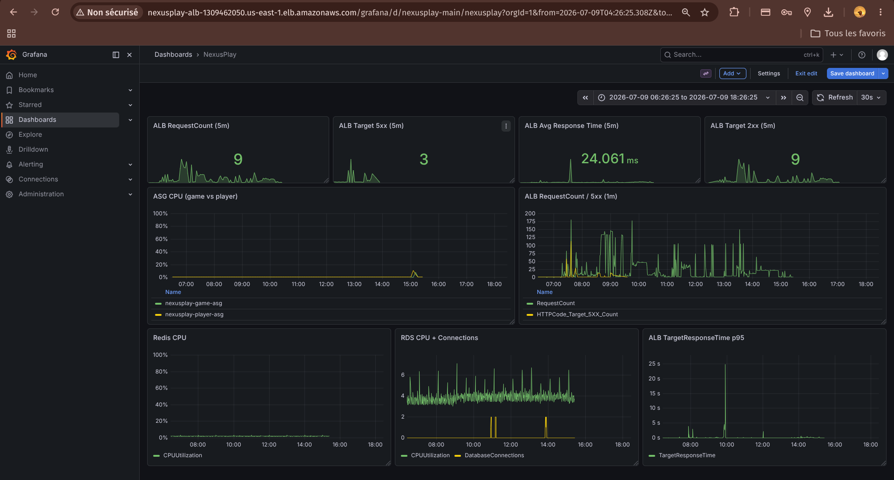

# Documentation Technique de l'Architecture

Ce document détaille l'implémentation et la validation technique de l'infrastructure et des composants logiciels du projet. L'ensemble de l'architecture est déployé sur AWS à l'aide de CloudFormation.

---

## 1. Architecture Microservices

### Implémentation
L'application est architecturée autour de deux microservices développés avec le framework FastAPI (Python) :
- **game-service** : Gère l'état du jeu, le leaderboard et sert les ressources statiques. Il implémente un pattern cache-aside (Redis) avec persistance PostgreSQL.
- **player-service** : Gère les opérations CRUD (Create, Read, Update, Delete) sur les entités joueurs via PostgreSQL.

Chaque service est conteneurisé indépendamment (Docker) et s'exécute au sein de son propre groupe d'Auto Scaling (ASG) avec des Launch Templates distincts, assurant une isolation totale au niveau de l'infrastructure de calcul.

### Références
- Code : [game-service/main.py](file:///home/ascadia/Documents/dark-project/services/game-service/main.py), [player-service/main.py](file:///home/ascadia/Documents/dark-project/services/player-service/main.py)
- Infrastructure : [cloudformation/60-app.yaml](file:///home/ascadia/Documents/dark-project/cloudformation/60-app.yaml)

### Validation
Les images Docker sont stockées dans des dépôts Elastic Container Registry (ECR) distincts et les services répondent via l'ALB :
```bash
$ aws ecr describe-repositories --query 'repositories[*].repositoryName' --output text
nexusplay/game-service    nexusplay/player-service

$ curl -s http://<ALB_URL>/version
{"service":"game","version":"v2","build":"local","stage":"ci-cd","ts":1752076432.1}

$ curl -s http://<ALB_URL>/players/1
{"player": {"id": 1, "name": "test-player", "level": 1}}
```

---

## 2. Équilibrage de charge et redondance

### Implémentation
La distribution du trafic entrant est gérée par un Application Load Balancer (ALB) exposé sur internet. Le routage est effectué au niveau de la couche 7 (HTTP) via des règles basées sur les chemins :
- `/game/*` et `/` vers le Target Group `game-service`
- `/players/*` vers le Target Group `player-service`

La redondance est garantie par le déploiement sur deux zones de disponibilité (us-east-1a, us-east-1b). La haute disponibilité intra-service est assurée par une capacité minimale (`MinSize`) de 2 instances par service. Des contrôles d'intégrité (Health Checks) sur l'endpoint `/healthz` permettent à l'ALB d'écarter automatiquement les instances défaillantes.

### Références
- Infrastructure : [cloudformation/70-alb.yaml](file:///home/ascadia/Documents/dark-project/cloudformation/70-alb.yaml)

### Validation
L'ALB identifie correctement l'état des instances sous-jacentes. En cas d'arrêt d'un conteneur, l'instance est marquée comme `unhealthy`.
```bash
$ aws elbv2 describe-target-health \
    --target-group-arn arn:aws:elasticloadbalancing:...:targetgroup/nexusplay-game-tg/... \
    --query 'TargetHealthDescriptions[*].[Target.Id,TargetHealth.State]' --output table
-----------------------------------
|  i-0abc12345678  |  healthy  |
|  i-0def87654321  |  healthy  |
-----------------------------------
```

---

## 3. Scalabilité automatique

### Implémentation
Les groupes d'Auto Scaling (ASG) intègrent des politiques de suivi de cible (Target Tracking) basées sur la métrique `ASGAverageCPUUtilization`. Le seuil de déclenchement est fixé à 50% d'utilisation CPU moyenne. La capacité peut évoluer dynamiquement entre 2 et 3 instances (`MaxSize: 3`).

En complément de l'approche réactive, des actions planifiées (Scheduled Actions) sont définies pour augmenter la capacité de base (MinSize: 3) à 18h00 UTC et la réduire à 23h00 UTC, anticipant ainsi les pics de charge liés aux événements communautaires.

### Références
- Infrastructure : [cloudformation/80-autoscaling.yaml](file:///home/ascadia/Documents/dark-project/cloudformation/80-autoscaling.yaml)

### Validation
Suite à une saturation CPU volontaire (via l'utilitaire `stress-ng`), l'ASG ajoute dynamiquement une instance :
```bash
$ aws autoscaling describe-scaling-activities \
    --auto-scaling-group-name nexusplay-game-asg \
    --query 'Activities[0].[Cause,StatusCode]' --output text
At 2026-07-08T..., a monitor alarm TargetTracking-nexusplay-game-asg-AlarmHigh... transitioned to ALARM state. Launching a new EC2 instance: i-087afed10048b3df8    Successful

$ aws autoscaling describe-auto-scaling-groups \
    --auto-scaling-group-names nexusplay-game-asg \
    --query 'AutoScalingGroups[0].[DesiredCapacity,Instances[*].InstanceId]'
[
  3,
  ["i-0abc12345678", "i-0def87654321", "i-087afed10048b3df8"]
]
```

---

## 4. Monitoring centralisé

### Implémentation
L'observabilité de l'infrastructure est centralisée dans Amazon CloudWatch :
1. **Collecte des logs** : L'agent CloudWatch (`amazon-cloudwatch-agent`) est déployé sur les instances EC2 pour collecter les logs JSON des conteneurs Docker et les agréger dans le groupe de logs `/aws/nexusplay/app`.
2. **Métriques et filtres** : Un Metric Filter analyse les flux de logs et incrémente la métrique personnalisée `NexusPlay/App.AppErrors` à chaque occurrence du mot "ERROR".
3. **Tableau de bord** : Le dashboard `NexusPlay` offre une vue unifiée (7 widgets) consolidant les requêtes ALB, l'utilisation CPU des ASG, les ressources RDS/ElastiCache et les erreurs applicatives.

### Références
- Infrastructure : [cloudformation/90-monitoring.yaml](file:///home/ascadia/Documents/dark-project/cloudformation/90-monitoring.yaml)
- Scripts : [scripts/install-cwagent.sh](file:///home/ascadia/Documents/dark-project/scripts/install-cwagent.sh)

### Validation
Vérification des flux de logs collectés par instance :
```bash
$ aws logs describe-log-streams --log-group-name /aws/nexusplay/app --query 'logStreams[*].logStreamName' --output text
i-0abc12345678  i-0def87654321

$ aws logs filter-log-events --log-group-name /aws/nexusplay/app --limit 1 --query 'events[0].message'
"{\"log\":\"INFO: 172.31.33.112 - \\\"GET /healthz HTTP/1.1\\\" 200 OK\\n\"}"
```

L'interface Grafana fournit également un tableau de bord visuel regroupant toutes les métriques en temps réel :


---

## 5. Test de charge et validation des performances

### Implémentation
Les performances de l'API sont validées à l'aide de l'outil `k6`. Le scénario de test (`loadtest.js`) simule un trafic utilisateur avec une montée en charge progressive (ramp-up) atteignant 200 utilisateurs virtuels concurrents sur une durée de 7 minutes. Les requêtes ciblent à la fois la lecture en base de données et le comportement du cache-aside.

Des seuils de succès (Thresholds) stricts sont définis :
- Taux d'échec HTTP inférieur à 1% (`http_req_failed < 0.01`).
- Latence au 95e percentile (p95) inférieure à 500ms (`http_req_duration p(95) < 500`).
- Moins de 50 erreurs applicatives globales (`app_errors < 50`).

### Références
- Scripts : [scripts/loadtest.js](file:///home/ascadia/Documents/dark-project/scripts/loadtest.js), [scripts/loadtest.sh](file:///home/ascadia/Documents/dark-project/scripts/loadtest.sh)

### Validation
Exécution du scénario k6 et respect des seuils de performance :
```bash
$ k6 run scripts/loadtest.js
  ...
     checks.....................: 100.00% ✓ 18896  ✗ 0
     http_req_duration..........: avg=2.27ms  min=0.8ms  med=1.9ms  max=45ms   p(95)=5.1ms
     http_req_failed............: 0.00%   ✓ 0      ✗ 9448

     ✓ http_req_failed..........: rate<0.01     ✓
     ✓ http_req_duration........: p(95)<500     ✓
     ✓ app_errors...............: count<50      ✓
```

---

## 6. Intégration d'un système de cache

### Implémentation
Le composant `game-service` utilise un cluster Amazon ElastiCache pour Redis (version 7.1) afin de réduire la charge sur la base de données PostgreSQL et améliorer les temps de réponse via un pattern Cache-Aside :
1. **Lecture** : Requête sur Redis. En cas de cache miss, requête SQL suivie d'une insertion dans Redis avec un TTL (60s pour l'état, 30s pour le leaderboard).
2. **Écriture** : Mise à jour PostgreSQL (UPSERT) suivie d'une invalidation de la clé correspondante dans Redis.

Le cluster est composé d'un nœud primaire et d'un réplica. Les échanges sont sécurisés par un chiffrement TLS en transit, un chiffrement au repos et une authentification via token (AUTH).

### Références
- Application : [services/game-service/main.py](file:///home/ascadia/Documents/dark-project/services/game-service/main.py)
- Infrastructure : [cloudformation/40-cache.yaml](file:///home/ascadia/Documents/dark-project/cloudformation/40-cache.yaml)

### Validation
L'impact du pattern cache-aside est observable lors d'appels consécutifs :
```bash
# Premier appel : Cache Miss
$ curl -s http://<ALB_URL>/game/state/1 | jq .source
"db"

# Second appel : Cache Hit
$ curl -s http://<ALB_URL>/game/state/1 | jq .source
"cache"

# Mise à jour de l'état (invalidation)
$ curl -s -X POST http://<ALB_URL>/game/move/1 -d '{"score": 42}' > /dev/null

# L'appel suivant retourne sur la base de données
$ curl -s http://<ALB_URL>/game/state/1 | jq .source
"db"
```

---

## 7. Gestion sécurisée des secrets

### Implémentation
Les identifiants sensibles (mot de passe RDS, token d'authentification Redis, clés de session) ne sont jamais intégrés dans le code source ni stockés sur les disques des instances. Ils sont gérés par **AWS Secrets Manager**.

À l'initialisation de l'application, le module de configuration Python (`config.py`) s'authentifie via le profil d'instance IAM (LabRole) et interroge l'API Secrets Manager au travers d'un VPC Endpoint dédié, évitant ainsi tout trafic transitant par internet.

### Références
- Infrastructure : [cloudformation/30-secrets.yaml](file:///home/ascadia/Documents/dark-project/cloudformation/30-secrets.yaml)
- Application : [services/common/config.py](file:///home/ascadia/Documents/dark-project/services/common/config.py)

### Validation
La récupération des secrets fonctionne correctement depuis l'environnement AWS.
```bash
# Récupération de la valeur du secret par l'API AWS
$ aws secretsmanager get-secret-value --secret-id nexusplay-db-password --query 'SecretString' --output text
<mot_de_passe_genere_aleatoirement>
```

---

## 8. Système d'alerte et de notification

### Implémentation
Le suivi proactif des incidents s'appuie sur des alarmes Amazon CloudWatch couplées à un topic **Amazon Simple Notification Service (SNS)** nommé `nexusplay-alerts`. Les administrateurs y sont abonnés par email.
Le déclenchement d'une alerte notifie automatiquement le canal SNS lors des situations suivantes :
- Surcharge de connexions RDS (> 80).
- Pics CPU soutenus sur les ASG (> 70%).
- Augmentation anormale des requêtes HTTP 5xx au niveau de l'ALB.
- Taux d'erreurs applicatives élevé identifié via l'analyse des logs (Filtre de métrique).

### Références
- Infrastructure : [cloudformation/100-notifications.yaml](file:///home/ascadia/Documents/dark-project/cloudformation/100-notifications.yaml)

### Validation
Le topic de notification est configuré et lié aux alarmes d'infrastructure.
```bash
# L'alarme ALB 5xx est bien configurée avec l'action SNS appropriée
$ aws cloudwatch describe-alarms --alarm-names nexusplay-alb-5xx --query 'MetricAlarms[0].AlarmActions' --output text
arn:aws:sns:us-east-1:<AccountID>:nexusplay-alerts

# Confirmation de l'abonnement email
$ aws sns list-subscriptions-by-topic --topic-arn arn:aws:sns:us-east-1:<AccountID>:nexusplay-alerts --query 'Subscriptions[*].Protocol' --output text
email
```

---

## 9. Serveur DNS interne hautement disponible

### Implémentation
La résolution de noms interne (VPC) est gérée par un cluster de serveurs **BIND9** en configuration Maître/Esclave (Primary/Secondary), garantissant une haute disponibilité (Active/Backup).
- **Découverte dynamique** : Le serveur primaire exécute une tâche planifiée (cron) chaque minute. Un script shell interroge l'API AWS (via des tags EC2 ou des identifiants) pour mettre à jour la zone DNS interne `nexusplay.lab` avec les adresses IP privées de l'ALB, des instances EC2, de la base RDS et du cluster Redis.
- **Réplication** : Les modifications de la zone sont transférées en temps réel au serveur secondaire (AXFR) qui maintient un cache opérationnel.

Les instances EC2 applicatives sont configurées (via `/etc/resolv.conf`) pour pointer vers ces serveurs, avec un fallback vers le DNS interne d'AWS.

### Références
- Infrastructure : [cloudformation/20-dns.yaml](file:///home/ascadia/Documents/dark-project/cloudformation/20-dns.yaml)
- Scripts : [scripts/dns-update-zone.sh](file:///home/ascadia/Documents/dark-project/scripts/dns-update-zone.sh)

### Validation
Le DNS interne permet de résoudre correctement l'ensemble des ressources privées de l'infrastructure à partir d'une instance.
```bash
# Test de résolution via le serveur primaire (172.31.33.112)
$ dig @172.31.33.112 db.nexusplay.lab +short
172.31.A.B

# Test de résolution via le serveur secondaire (172.31.41.135)
$ dig @172.31.41.135 redis.nexusplay.lab +short
172.31.X.Y
```
